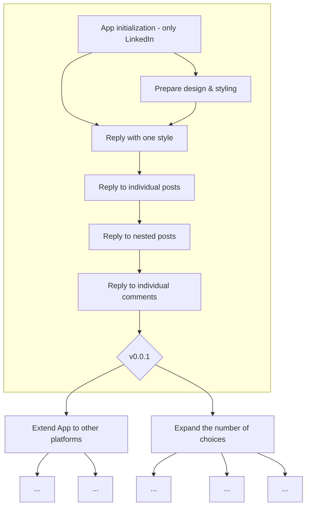

# New Native Comment Responder Chrome/Edge Extension

Chrome/Edge extension for generating replies for social media comments and posts powered by GPT-3.

## Links 
- [Chrome Web Store Listing](https://chrome.google.com/webstore/detail/new-native-comment-respon/kpgoohadpcihgplopjohkjchpaklfdil)
- [Chrome Web Store Developer Dashboard](https://chrome.google.com/webstore/devconsole/cc33855b-d475-4c08-9949-b2b5fc39026c/kpgoohadpcihgplopjohkjchpaklfdil/edit/status)

## Supported sites

- &#9745; LinkedIn
- &#9744; Twitter
- &#9744; Instagram
- &#9744; Facebook

## Project roadmap

## Installation guide

### Download the extension

1. Go to github repo: https://github.com/nextgrid/comment-responder-extension
2. Click on "<> Code" and download the zip file

3. Download it
4. Unzip it into a folder that you can easily find :)

### Install the extension

#### Google Chrome

> In the address bar type: `chrome://extensions/`
1. Turn on developer mode
2. Load unpacked file (find the folder where you unpacked the zip file)
3. Turn on the extension

#### Microsoft Edge

> In the address bar type: `edge://extensions/`

1. Turn on developer mode
2. Load unpacked file (find the folder where you unpacked the zip file)
3. Turn on the extension

